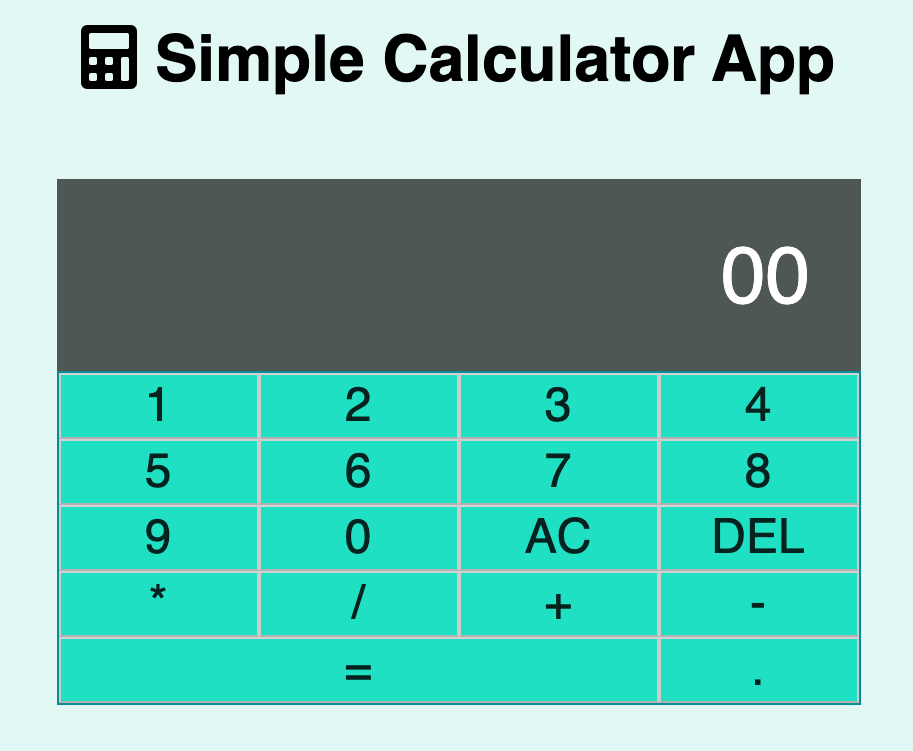

# theCalc App

A fun calculator app I built using straight vanilla. It has basic arithmetic functionality but it's still very useful.

HTML, CSS, JS

Live Link = https://hopeful-saha-3b71cb.netlify.app

<h3>Summary</h3>
I built this app because I wanted to always build the classic calculator. I also like math so I enjoyed building it from the beginning through the end. I learned many things from creating this App but one that stands out to me the most is the ability to use JS Math object. I never learned used it before but now I understand it a lot better.
<h3>Author</h3>

Roger Alexander - Full Stack Developer <a href="http://www.douschesois.com">Portfolio Website</a> | <a href="https://www.linkedin.com/in/roger-alexander-37925619a/">Linked In</a>
